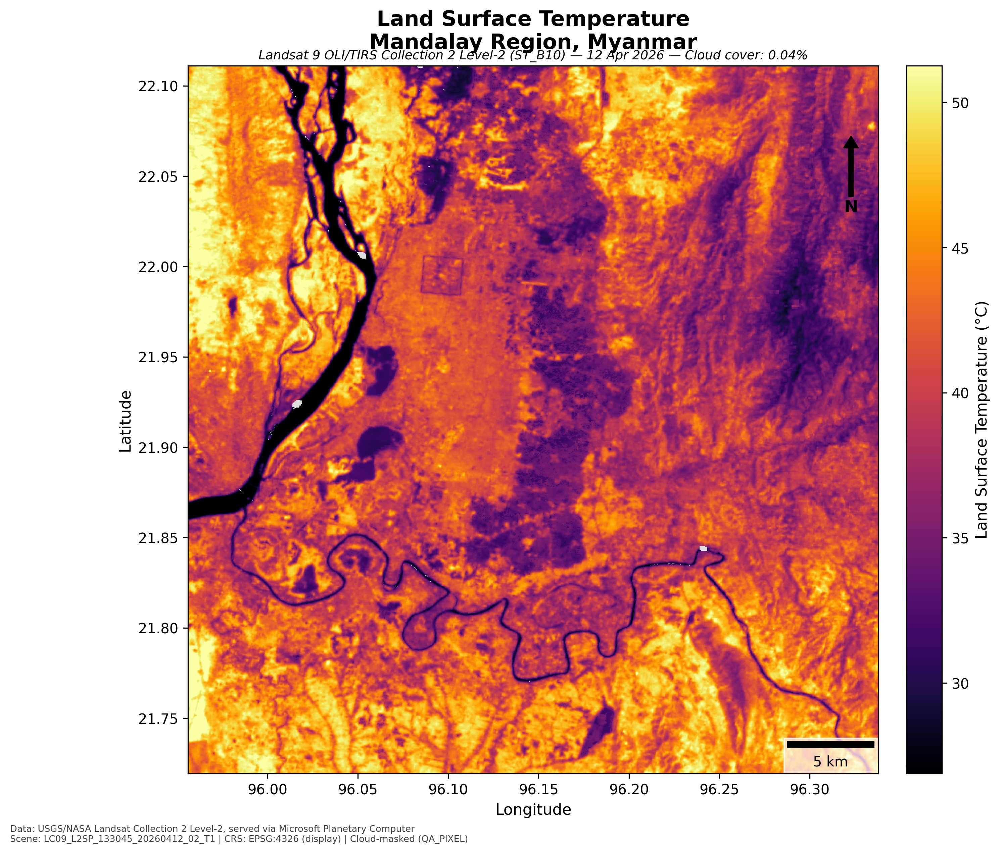

# Landsat LST from Microsoft Planetary Computer

Download the best available Landsat 8/9 Collection 2 Level-2 scene for a
bounding box from [Microsoft Planetary Computer](https://planetarycomputer.microsoft.com/),
derive Land Surface Temperature (LST), and export a publication-ready JPEG map.



*Example: Mandalay Region, Myanmar — Landsat 9, 12 Apr 2026, 0.04% cloud cover.*

## How it works

1. **Scene selection** — Queries the `landsat-c2-l2` STAC collection for
   Landsat 8/9 Tier 1 scenes whose footprint fully contains the requested
   bounding box. Among those, it prefers the most recent scene at or below a
   cloud-cover threshold (`--max-cloud-cover`, default 1%); if none qualify,
   it falls back to the least-cloudy fully-covering scene available.
2. **LST retrieval** — Downloads the `ST_B10` (surface temperature),
   `QA_PIXEL`, and `ST_QA` (surface temperature uncertainty) bands clipped to
   the bounding box. `ST_B10` digital numbers are converted to Kelvin using
   USGS's published scale/offset (`DN × 0.00341802 + 149.0`) and then to
   Celsius. This band already includes atmospheric correction and
   NDVI-based emissivity, so no additional split-window/mono-window
   correction is needed.
3. **Cloud masking** — Pixels flagged in `QA_PIXEL` as fill, dilated cloud,
   cirrus, cloud, or cloud shadow are masked out of the result.
4. **Rendering** — Produces a publication-ready map with a temperature
   colorbar, title/subtitle (scene ID, acquisition date, cloud cover), scale
   bar, north arrow, and data attribution, saved as a JPEG.

## Installation

```bash
pip install -r requirements.txt
```

Requires Python 3.9+. No Planetary Computer account or API key is needed for
STAC search or public COG access.

## Usage

```bash
python landsat_lst.py \
  --bbox 95.964203 21.725697 96.330872 22.104726 \
  --region-name "Mandalay Region, Myanmar" \
  --out examples/LST_Mandalay_20260412.jpg
```

### Arguments

| Flag | Description | Default |
|---|---|---|
| `--bbox MINX MINY MAXX MAXY` | Bounding box in WGS84 lon/lat (required) | — |
| `--out` | Output JPEG path | `lst_output.jpg` |
| `--region-name` | Region label shown in the map title | `Study Area` |
| `--max-cloud-cover` | Preferred cloud-cover threshold (%) for scene selection | `1.0` |
| `--lookback-days` | Only consider scenes from the last N days | unlimited |

The script prints the selected scene ID, acquisition date, cloud cover,
valid (clear-sky) pixel fraction, LST range/mean, and mean ST uncertainty to
stdout.

## Data source & attribution

- Landsat Collection 2 Level-2 data: USGS/NASA, distributed via
  [Microsoft Planetary Computer](https://planetarycomputer.microsoft.com/dataset/landsat-c2-l2).
- ST_B10 scale/offset and QA_PIXEL bit definitions: USGS Landsat Collection 2
  Level-2 Science Product Guide.

## License

MIT — see [LICENSE](LICENSE).
